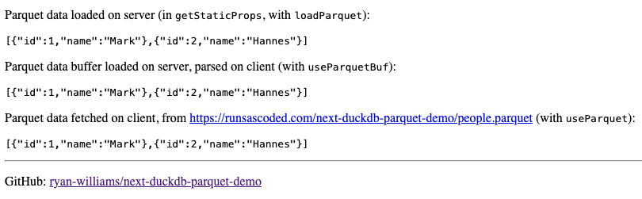

# next.js / duckdb-wasm parquet demo
Example [Next.js] app using [duckdb-wasm] to read/fetch Parquet files, in Node and the browser.

Demo: [runsascoded.com/next-duckdb-parquet-demo][demo]
[][demo]

## Relevant files:
- [pages/index.tsx](pages/index.tsx): shows 3 ways of loading Parquet data (on a mix of client and server):
  1. [`useParquetBuf`]: load parquet file as byte array on server, send to client, decode in browser (minimize data sent to client while loading a static page)
  2. [`loadparquet`]: load parquet file on server, send to client
  3. [`useParquet`]: fetch parquet file by URL on client
- [src/parquet.ts](src/parquet.ts): utilities for instantiating DuckDB and fetching/loading Parquet data
  - Copied from [runsascoded/next-utils/parquet.ts], adapted from [ilyabo/graphnavi/lib/useDuckConn.ts]
  - See also [duckdb-wasm#1148]
- [public/people.parquet](public/people.parquet): demo Parquet file, generated by [init-data.js](init-data.js)

## Live demo
[runsascoded.com/next-duckdb-parquet-demo][demo]:
> Parquet data loaded on server (in `getStaticProps`, with `loadParquet`):
> ```json
> [{"id":1,"name":"Mark"},{"id":2,"name":"Hannes"}]
> ```
> Parquet data buffer loaded on server, parsed on client (with `useParquetBuf`):
> ```json
> [{"id":1,"name":"Mark"},{"id":2,"name":"Hannes"}]
> ```
> Parquet data fetched on client, from [https://runsascoded.com/next-duckdb-parquet-demo/people.parquet](https://runsascoded.com/next-duckdb-parquet-demo/people.parquet) (with `useParquet`):
> ```json
> [{"id":1,"name":"Mark"},{"id":2,"name":"Hannes"}]
> ```

## Run locally
Dev mode:
```bash
next dev  # serve dev-mode site at http://127.0.0.1:3000
```

Build + Export:
```bash
next build
next export
http-server out  # serve static site from out/ dir
```

## Generate sample data
```bash
node init-data.js
```

Runs [init-data.js](init-data.js):
```node
const duckdb = require('duckdb')
const db = new duckdb.Database(':memory:')
db.run(`
CREATE TABLE people(id INTEGER, name VARCHAR);
INSERT INTO people VALUES (1, 'Mark'), (2, 'Hannes');
COPY (SELECT * FROM people) TO 'public/people.parquet' (FORMAT 'parquet');
`)
```

## ⚠️ Broken under "App Router" ⚠️ <a id="broken"></a>

For some reason, [the server-side `loadParquet` path][broken loadParquet] doesn't seem to work under [Next.js]'s new "App router" (also reported at [next.js#57819]).

Here's a trimmed down example (from [the @app-broken branch][@app-broken]):

- [pages/pages.tsx] ✅ works
- [app/app/page.tsx] ❌ broken

Attempting to load the latter emits this on the server side:
```
duckdb-wasm fetch
bestBundle: {
  mainModule: '/Users/ryan/c/next-duckdb-parquet-demo/node_modules/@duckdb/duckdb-wasm/dist/duckdb-eh.wasm',
  mainWorker: '/Users/ryan/c/next-duckdb-parquet-demo/node_modules/@duckdb/duckdb-wasm/dist/duckdb-node-eh.worker.cjs',
  pthreadWorker: null
}
made logger
made db
worker terminated with 1 pending requests
```
and the client hangs.

Similarly, `next build` times out, meaning I can't deploy a demo. [Here's a GitHub Actions run][failed GHA] that failed due to this issue.

`diff pages/pages.tsx app/app/page.tsx`:
```diff
-export async function getStaticProps() {
-    const data = await loadParquet<Person>(parquetPath)  // ✅ works fine under pages/
-    return { props: { data } }
-}
-
-export default function Home({ data }: { data: Person[] }) {
+export default async function Home() {
+    const data = await loadParquet<Person>(parquetPath)  // ❌ broken under app/
```

[This line][broken db instantiation line]:

```typescript
await db.instantiate(bundle.mainModule, bundle.pthreadWorker);
```
emits this error:
```
worker terminated with 1 pending requests
```

I haven't found any further leads about what might be going on.


[Next.js]: https://nextjs.org/
[duckdb-wasm]: https://github.com/duckdb/duckdb-wasm
[runsascoded/next-utils/parquet.ts]: https://github.com/runsascoded/next-utils/blob/25af539a1518dcc786de0892f265eb6c0245287a/src/parquet.ts
[ilyabo/graphnavi/lib/useDuckConn.ts]: https://github.com/ilyabo/graphnavi/blob/fd89fe77edd48614cc5a52772b5f9f66b214bbea/lib/useDuckConn.ts
[duckdb-wasm#1148]: https://github.com/duckdb/duckdb-wasm/issues/1148

[`useParquetBuf`]: src/parquet.ts#L132-L144
[`loadparquet`]: src/parquet.ts#L99-L105
[`useParquet`]: src/parquet.ts#L107-L120
[demo]: https://runsascoded.com/next-duckdb-parquet-demo

[pages/pages.tsx]: https://github.com/ryan-williams/next-duckdb-parquet-demo/blob/app-broken/pages/pages.tsx
[app/app/page.tsx]: https://github.com/ryan-williams/next-duckdb-parquet-demo/blob/app-broken/app/app/page.tsx
[@app-broken]: https://github.com/ryan-williams/next-duckdb-parquet-demo/tree/app-broken
[failed GHA]: https://github.com/ryan-williams/next-duckdb-parquet-demo/actions/runs/6708443526/job/18229259080

[broken db instantiation line]: https://github.com/ryan-williams/next-duckdb-parquet-demo/blob/app-broken/src/parquet.ts#L43
[broken loadParquet]: https://github.com/ryan-williams/next-duckdb-parquet-demo/blob/app-broken/src/parquet.ts#L66-L72
[next.js#57819]: https://github.com/vercel/next.js/discussions/57819
